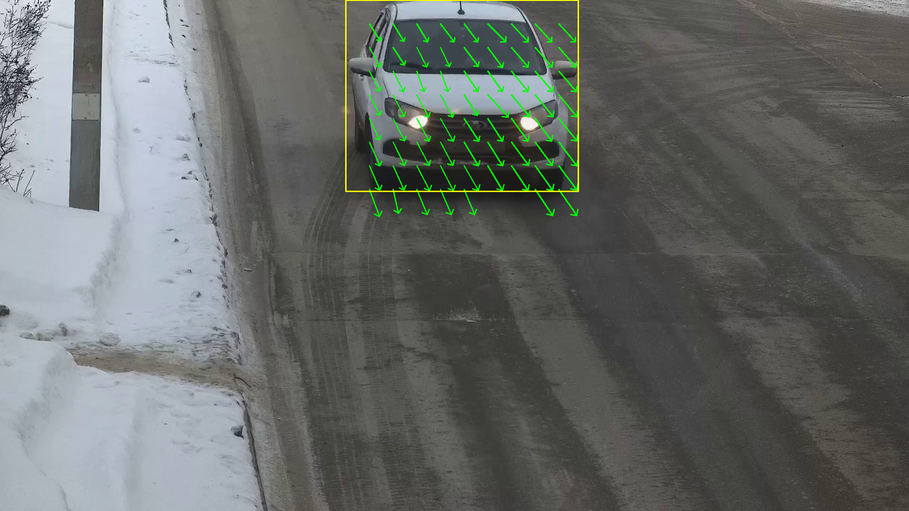
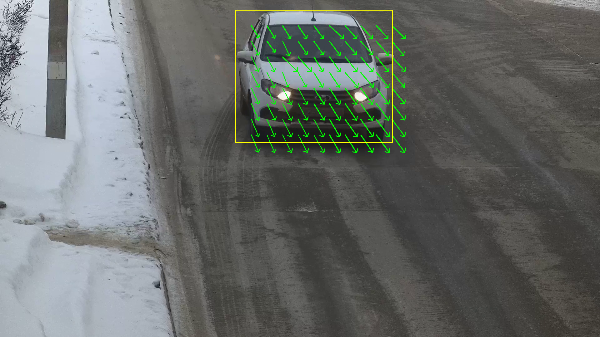
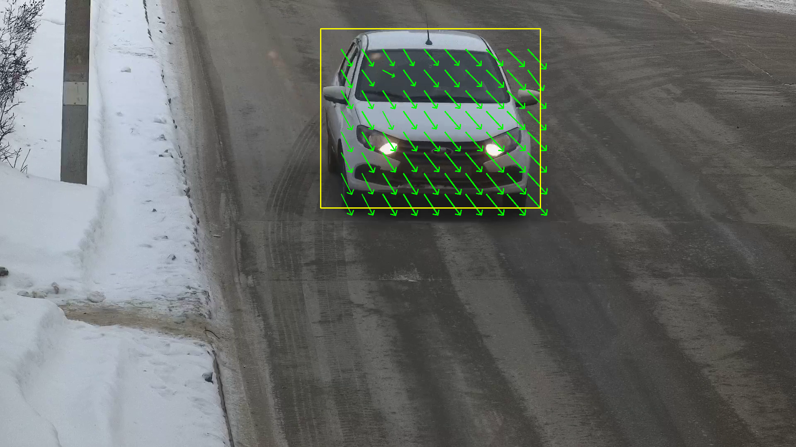
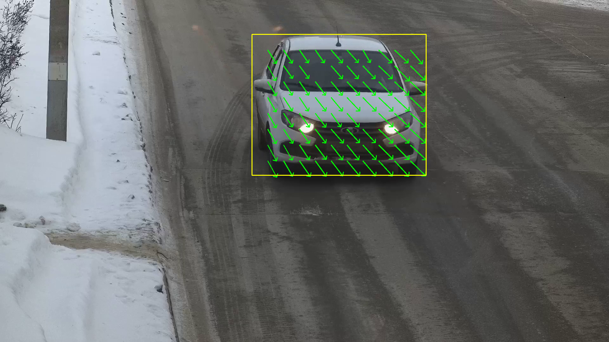
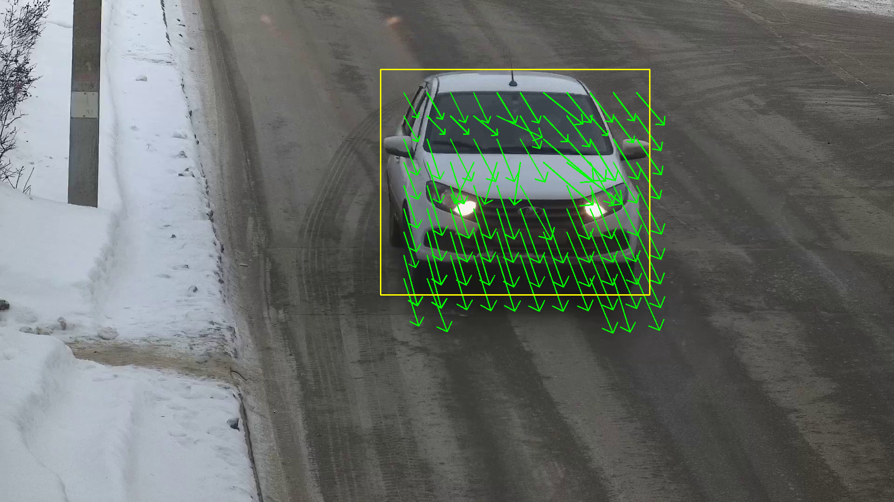
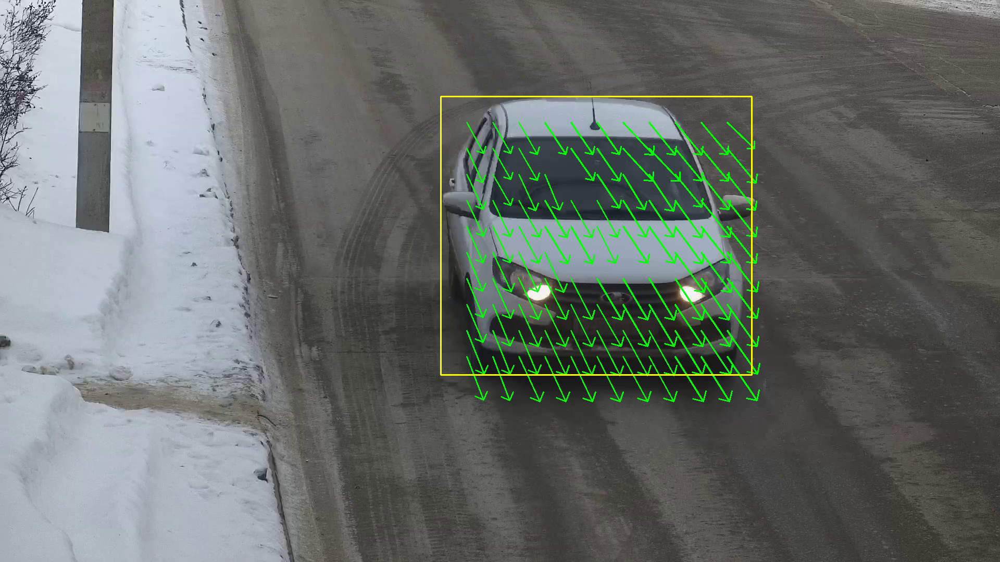
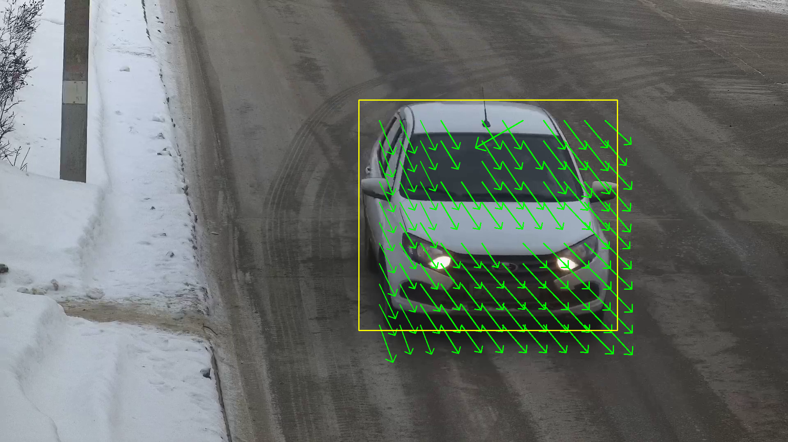
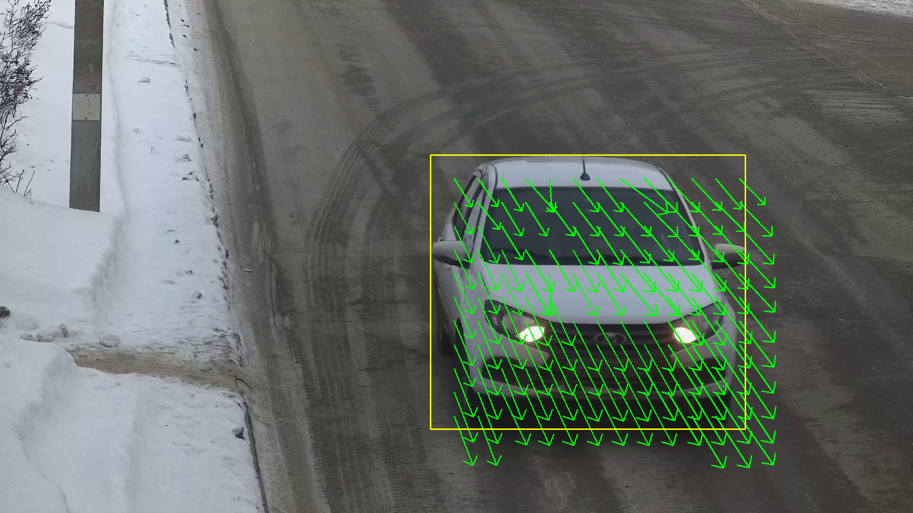
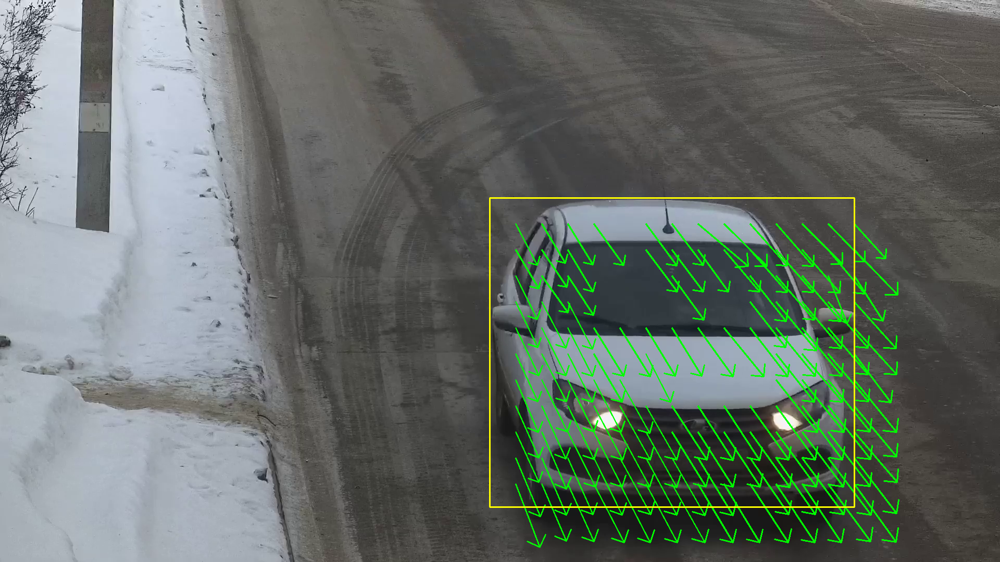
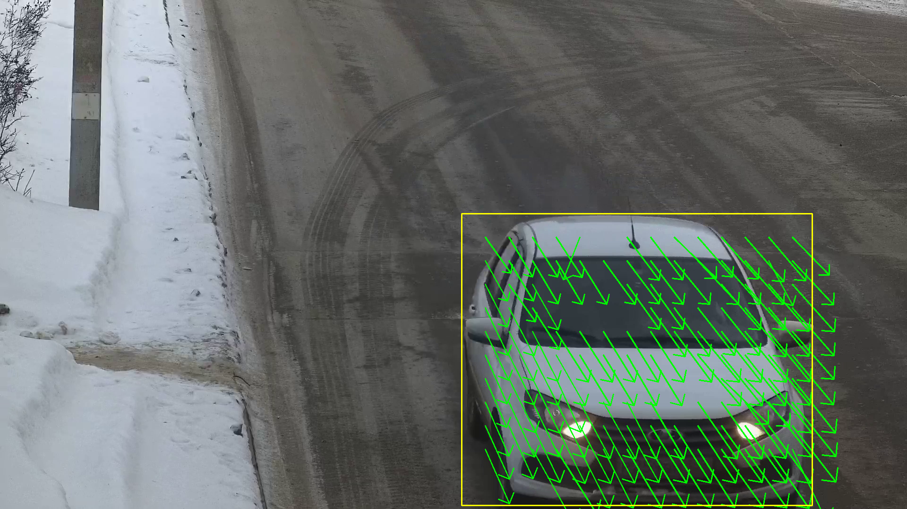

# Архитектура
В качестве детектора использовал YoloV11N. Сконверитровал ее в ONNX. По bbox считал опорные точки по сетке. Затем при помощи calcOpticalFlowPyrLK вычислял оптисечкий поток по двум изображениям и базовым точкам полученным с детектора.

# Примечания 
До конца не уверен что правильно собран sln файл. Собирал автоматически. Разрабатывал из vscode на linux. Есть два варианта на текущей версии под visual studio и без ide (ветка linux) Использовал opencv-4.9

# Результаты:

